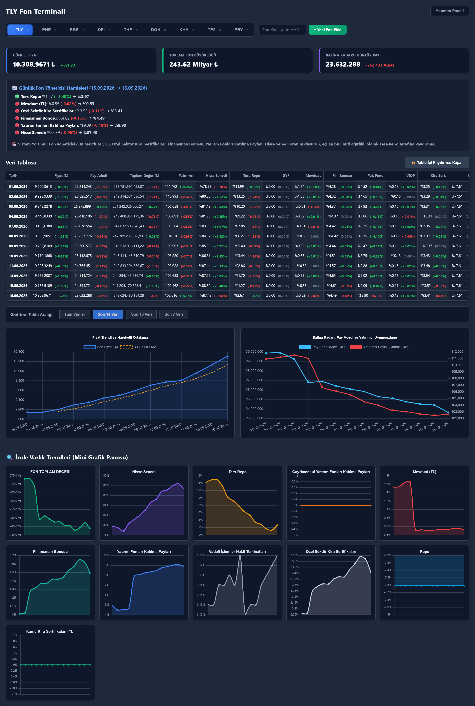

# TEFAS Fund Tracker (Fon Terminali) v5.3

This project was built to watch a handful of Turkish funds that were posting outsized, consistently positive returns — including funds I was invested in — and to see **when that would stop being sustainable.** TLY had years of that record. The others were newer: the same pattern, but for less than a year.

They had grown very large, and their investor counts had exploded. Ranking them by return was not the work; they already led the market. A run of daily gains pulls in more inflows, which helps produce the next gain. Two signals show that mechanism failing:

1. **Large holders leaving.** Investors who were in the fund before it opened to the broader public hold a disproportionate share of the units. If units outstanding fall while the investor count barely moves, informed capital is exiting. That is the whale radar: share-count change next to investor-count change.
2. **The portfolio itself.** For as long as these funds worked, they were concentrated in a few equities and absorbed price swings from a large cash pool — both to support those names and to meet redemptions. That arrangement fails when the liquid/illiquid mix deteriorates, or when holdings concentrate in names the fund can no longer move.

The terminal collects the daily TEFAS series (price, shares, investors, AUM, allocation). The KAP pipeline in [`kap_pdf_downloader/`](kap_pdf_downloader/) reads holdings, subsequent trades, and single-stock concentration. Together they exist to catch a break from either side, and to judge whether the same structure can keep delivering positive returns or is already failing. Return *level* was secondary in the software. The work was the timing.

What those numbers showed before September 2026 is in the [case study](case_study/CASE_STUDY_2026_09.md).



TLY as of 16.09.2026 — the last published TEFAS row before the suspension. Price and AUM still look fine; shares outstanding and reverse-repo are already falling. The charts below the table are the same window. The terminal keeps collecting after that date and shows a price of 0 as suspended. The KAP book does not: lots, closes, and AUM stop on 16.09.

That row is the fund from the outside. The book at the 16.09 close is the [KAP pipeline](kap_pdf_downloader/README.md). What the series showed before the break is in the [case study](case_study/CASE_STUDY_2026_09.md).

**Alerting (added after the September 2026 case study).** The dashboard applies the four rules from that write-up — whale day, share drain while price is flat (`Pay erimesi`), repo borrowing, net liquidity below zero — with the first/last fire date and the values that crossed the threshold. Outflow plus a thinning buffer is the high-severity case. A published price of 0 is shown as suspended, not as −100%.

The terminal is a FastAPI app. One process serves the dashboard and the API, keeps `fund_database.json` warm, and adds or hides funds from the UI. The rules above are attached in memory when that file is served; they are not written back into it.

What a refresh does now is the next section. The four diagnoses that produced it are in [Decisions that stuck](#decisions-that-stuck).

## How a refresh works

TEFAS publishes fund-level price, NAV, shares, investors, and asset mix, but not as a documented public API. The two list endpoints this pipeline reads (`fonGnlBlgSiraliGetirDosya`, `dagilimSiraliGetirT`) accept an optional fund filter. Leaving the filter off returns every fund in one response. The result is grouped locally. A routine refresh is one request per endpoint, whether you track 3 funds or 300. Distribution is paged, so a wider window adds pages; it does not add a request per fund.

The date range starts from the newest day already stored, plus a 3-day overlap so TEFAS revisions are still picked up. A fund with no rows gets a 30-day backfill. The window is capped at 60 days (`MAX_BULK_WINDOW_DAYS`); a longer gap is caught up over consecutive runs. If the fetched prices match what is stored, the run skips the distribution request and the write. An empty allocation on a fund that otherwise publishes a breakdown is fetched again. A fund that never publishes one stays `-`.

A short window over the whole list uses that bulk response. A 30-day backfill of one or two funds uses two direct requests, because bulk's cost follows the width of the date range. A code missing from a good bulk response takes the same direct path. A failed bulk request leaves each fund's `last_scraped_date` unchanged and waits for the next run.

Funds on the dashboard are included in the startup scan and in the hourly loop (`REFRESH_INTERVAL_MINUTES`). These endpoints are end-of-day; there is no intraday price here. The page is served immediately; the scrape runs beside it. A hidden fund with background tracking is included every 15 days (`BACKGROUND_TRACKING_INTERVAL_DAYS`). Hiding keeps the series. Permanent delete removes it. Re-adding fills about the last 30 days.

Requests go out over plain HTTPS. The Playwright handshake runs only when a call comes back `401` or `403`.

From the UI: "+ Yeni Fon Ekle" calls `POST /api/add-fund`. The "×" on a tab hides the fund, with the option to keep background tracking. A management panel lists hidden funds and can delete one for good. Charts are Chart.js.

## Timeline

| Date | | What changed |
|---|---|---|
| 21.07.2026 | | First commit. A browser loaded the fund page and the numbers were parsed out of the HTML. |
| 23.07.2026 | v4.0 | Moved onto the Next.js fund endpoints. Still a script, with fund codes hardcoded. |
| 25.07.2026 | v5.0 | FastAPI serves the dashboard. Funds are added and removed from the UI, and a hidden fund can keep its rows. |
| 27.07.2026 | v5.1 | Cached the browser handshake. Before this, every scrape launched Chromium. |
| 04.09.2026 | v5.2 | `429` is retried, the scan walks stalest-first, startup no longer blocks the page, and a running server refreshes hourly. A run still sent two requests per fund and waited 5–9s between funds. |
| 09.09.2026 | v5.3 | Both endpoints return every fund when the filter is omitted. Refresh cost stopped growing with the portfolio. The ordinary path no longer opens a browser. |
| 14.09.2026 | | An empty allocation on a day that already has a price is fetched again, instead of being stored as finished. |
| 30.09.2026 | | The four case-study rules appear on the dashboard. Written after the event. |

## Decisions that stuck

**Rate limit, misread as a bad fund code.** The funds added last showed numbers 2–3 days old, and the log said `No general info retrieved (invalid fund code, or no data for this period)`. Measured 2026-09-04: the first 6 of 11 funds succeeded, then every remaining call was `HTTP 429`. The client treated `429` like any other non-200 and dropped the fund. The scan always walked the file in insertion order, so the same tail missed every run. Retrying `429` (backoff, `Retry-After`, jitter) and scanning stalest-first stopped that starvation. The pause between funds was the intermediate fix; request count still grew with the list, which is the next decision.

**Empty allocation stored as a finished day.** TLY sat on the dashboard with a current price and `-` in every allocation column. TEFAS often publishes price and AUM before that day's breakdown. The first scrape wrote an empty `Varliklar`, and the no-op guard treated that empty dict as a completed fetch, so later hourly runs skipped it. (TLY on 14.09.2026 stayed in that state until the distinction was added.) `YAS` never returns distribution at all, so a dash there is a missing series, not a one-day hole.

**Cost that scaled with the portfolio.** After the limiter was handled, 11 funds still took about 110s: two requests each, plus 5–9s between funds. Thirty funds would have been 60 requests and minutes of waiting before the `429`s a burst that size provokes. Both calls were already list-shaped (`aramaMetni`, `basSira`/`bitSira` on the distribution endpoint). Dropping the fund filter returns the whole board. Measured 2026-09-09: general info for 2041 funds in 0.45s, distribution for 1907 funds in 1.01s. A fully stale refresh of the tracked set went from ~110s and 22 requests to **4.8s and 4 requests**. A quiet hour is **0.8s and 1 request**. Adding one fund from the UI went from ~17s to **0.7s**.

**History longer than the backfill.** Deleting a fund's rows to tidy the dashboard threw away every day older than the fresh-add backfill above. Hiding the fund keeps that longer series on disk and refreshes it on the 15-day cadence. Permanent delete is the action that actually drops the earlier months.

## Tech stack

- **Backend:** Python 3.9+, FastAPI, Uvicorn, Requests, Playwright (only if TEFAS starts requiring a browser session again)
- **Frontend:** HTML5, vanilla JavaScript, CSS
- **Charts:** Chart.js (CDN)

## Installation

```bash
git clone https://github.com/Raknero/r-d.git
cd r-d/fon_terminal

python -m venv .venv
source .venv/bin/activate   # Windows: .venv\Scripts\activate

pip install -r requirements.txt
playwright install chromium
```

`playwright install chromium` is for the `401`/`403` fallback. Ordinary refreshes do not launch it.

The signal tests import the KAP package, so that install needs both requirement files:

```bash
pip install -r requirements.txt -r kap_pdf_downloader/requirements.txt
python -m unittest discover -s tests
```

```bash
uvicorn main:app --reload
```

Open `http://127.0.0.1:8000`. The page loads from whatever is already in `fund_database.json`; the startup scan follows in the background (`[STARTUP]` in the terminal, then `[REFRESH]` once an hour). There is no fund list to hardcode. The file is what gets scanned, and new codes are added from the UI.

`data_scraper.py` is the same `scrape_and_update()` without the server:

```bash
python data_scraper.py          # every fund in fund_database.json
python data_scraper.py TLY PHE  # just these
```

## API

| Endpoint | Method | Body / params | Description |
|---|---|---|---|
| `/api/add-fund` | `POST` | `{"fund_code": "MAC"}` | Scrapes the code and shows it on the dashboard. |
| `/api/remove-fund` | `POST` | `{"fund_code": "MAC", "keep_tracking": true}` | Hides the tab. `keep_tracking: true` leaves a 15-day background refresh. |
| `/api/hard-delete-fund` | `DELETE` | `?fund_code=MAC` | Deletes the fund and its history. |

## Data schema

`fund_database.json` is local and gitignored. Each fund has `_metadata` plus chronological `records`. Files from before v5.0 are a bare list of records; the first load upgrades them in place.

```json
{
    "TLY": {
        "_metadata": {
            "show_on_ui": true,
            "background_tracking": false,
            "last_scraped_date": "2026-09-16"
        },
        "records": [
            { "Tarih": "16.09.2026", "Fiyat": 10308.9671, "...": "..." }
        ]
    }
}
```

| Field | Description |
|---|---|
| `_metadata.show_on_ui` | Tab visible on the dashboard. |
| `_metadata.background_tracking` | Hidden fund still refreshed every 15 days. |
| `_metadata.last_scraped_date` | Last successful scrape (`YYYY-MM-DD`). |
| `records[].Tarih` | Row date (`DD.MM.YYYY`). A row dated T is published on T and valued at the previous business day's close. |
| `records[].Fiyat` | Unit price. `0` means suspended. |
| `records[].Pay` | Shares outstanding. |
| `records[].ToplamDeger` | Total net asset value (TRY). |
| `records[].Yatirimci` | Investor count. |
| `records[].Varliklar` | Asset type → percent of NAV. Repo can be negative. Keys are the full TEFAS names, not the raw abbreviations. |

## Troubleshooting

- **`[ERROR] [HANDSHAKE] Failed to capture Authorization token`.** The fallback browser session did not capture a Bearer token. TEFAS may have changed that flow; see `acquire_session_credentials()` in `data_scraper.py`. Set `TEFAS_HANDSHAKE_HEADLESS=0` to watch the window. Closing it fails that handshake only.
- **`401`/`403`.** `post_tefas_endpoint()` drops the cached session, runs the handshake, and retries that request once. Look for `[CACHE] Cached TEFAS session token invalidated.` `[CACHE] Reusing cached TEFAS session token` means a later call on the fallback path skipped a new browser launch. The cache lasts for the process.
- **`HTTP 429`.** TEFAS is limiting, not rejecting the code. The client backs off (and honors `Retry-After`). A fund that still fails keeps its old `last_scraped_date`, so the next scan reaches it. Restarting the server in a tight loop is the quickest way to provoke this locally: each boot starts a scan.
- **`[BULK] ... zaten guncel; dagilim istegi ve veritabani yazimi atlandi`.** Nothing new; 1 request, no write. If the latest row is `-` in every allocation column and older rows are filled, that hole pulls distribution (2 requests that hour) for funds that publish a breakdown.
- **`[TEK FON]`.** Direct requests: either one or two funds over a wide window, where that is cheaper, or a code missing from the bulk body. The log line says which.
- **`Dagilim verisi N sayfada bitmedi`.** An all-funds distribution pull is ~2000 rows per day, so a wide window needs several pages (`basSira`/`bitSira`). Lower `MAX_BULK_WINDOW_DAYS` or raise `BULK_MAX_PAGES` in `data_scraper.py`.
- **Intervals.** 15-day hidden-fund cadence and the hourly loop are `BACKGROUND_TRACKING_INTERVAL_DAYS` and `REFRESH_INTERVAL_MINUTES` in `main.py`. Backoff and the pause on the direct path are `RATE_LIMIT_*` and `INTER_FUND_DELAY_RANGE_SECONDS` in `data_scraper.py`.
