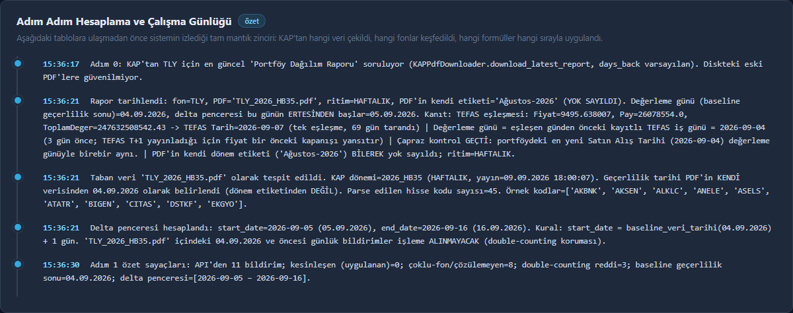
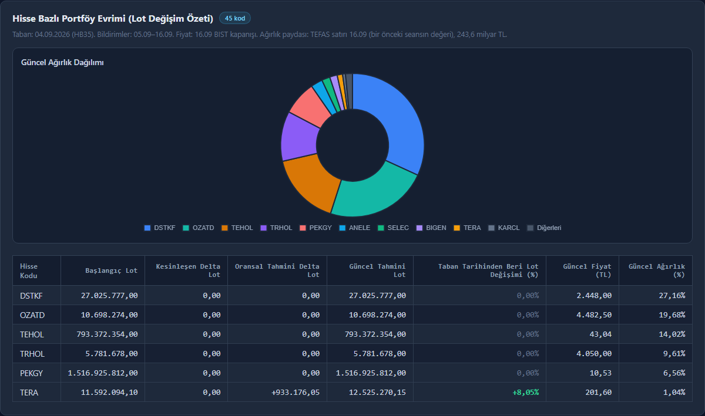
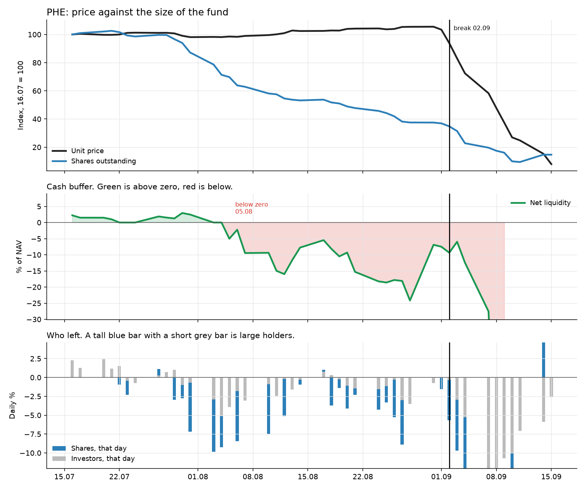
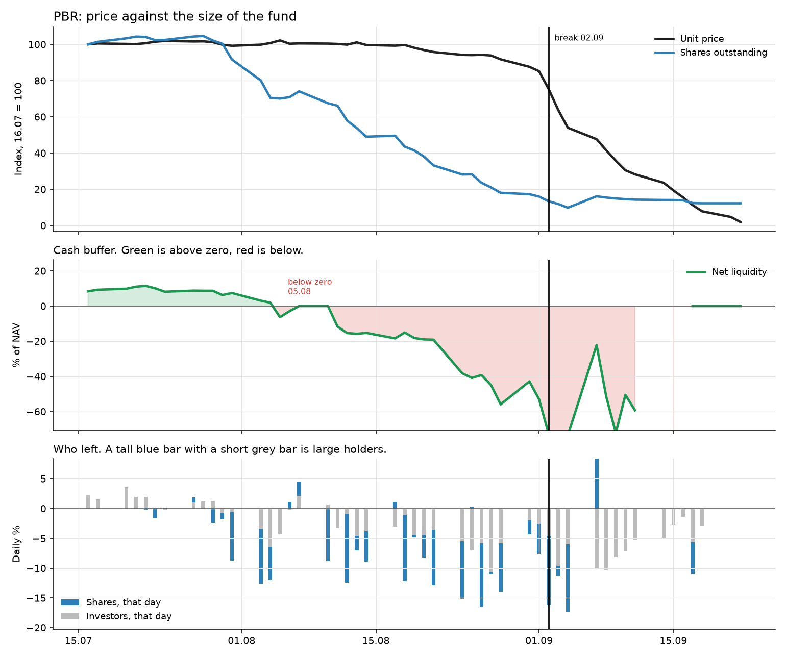
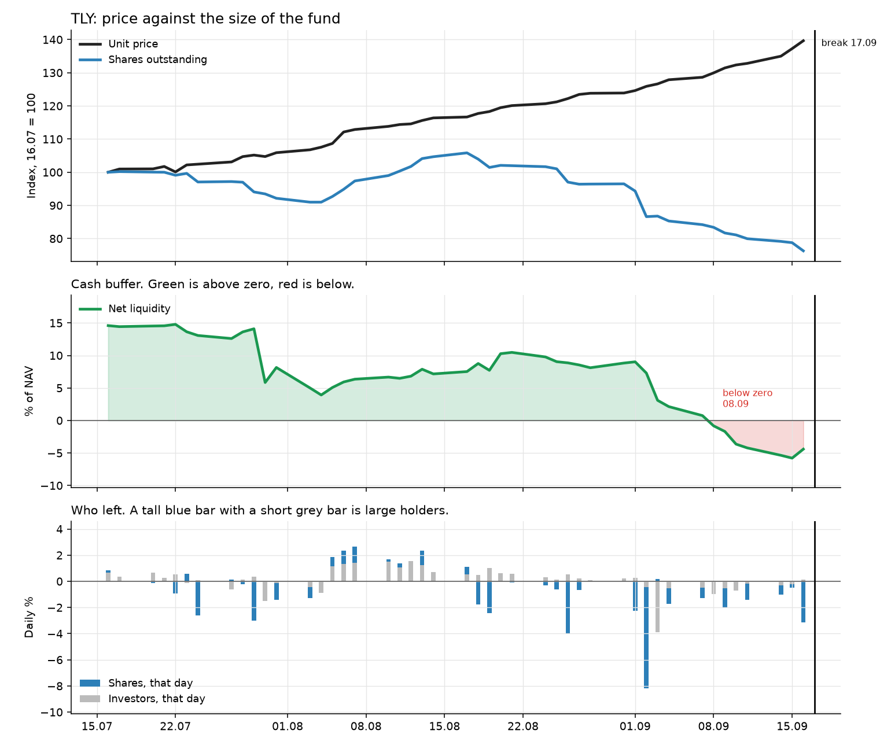
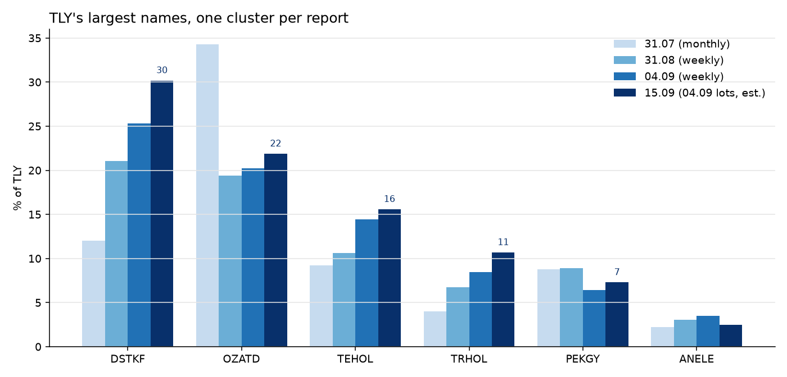
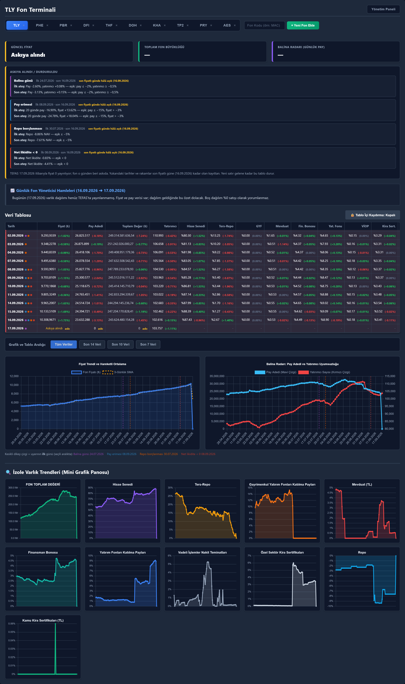

# Case Study: The September 2026 Turkish Fund Run: What the Data Showed Before the Collapse

This project was built to see whether a fund that was posting outsized, steady
gains could keep doing that, and to see the failure while there was still time
to act. The break we weighted most, and the one we asked first, was liquidity:
**could this fund pay everyone who wants out at the same time?** A fund can also
stop working when its book concentrates in names it can no longer sell, or when
the cash that absorbed those swings is gone. Paying everyone out is the sharp
edge of that larger question, not the whole of it.

In September 2026 that failure happened. This document replays the data the
terminal had already collected, day by day, and asks what was visible and when.

**Short answer:** for the two funds that failed first (PHE, PBR), the balance-sheet
signals were visible **about four weeks** before the price broke. For TLY, the
redemption signals were visible for weeks and the liquidity buffer crossed
below zero **seven business days** before trading was suspended. Throughout,
the unit price, the number most investors look at, was the one indicator that
said nothing until it was too late.

---

## 1. What happened (context)

1. **Weekly disclosure.** After heavy outflows at some funds, the regulator
   moved fund portfolio reports from monthly to weekly, and introduced
   single-stock concentration limits on a short timeline.
2. **PHE and PBR.** Both funds faced a sustained redemption run. With almost no
   cash, they sold whatever they held and borrowed via repo to pay leavers. Their
   holdings went limit-down, the fall in unit price triggered more redemptions,
   and from 02.09 both funds lost most of their value within days.
3. **16.09, TLY.** The largest holdings of TLY (one of the largest funds of
   Türkiye's largest fund manager, Tera) opened limit-down. Other large
   equity-heavy funds (e.g. DFI) were hit the same day. That evening the manager
   declared a default-style regime: orders after the cut-off would be priced
   once a month and paid ten days later.
4. **17.09.** The regulator announced liquidation of 131 funds, halted
   subscriptions and redemptions, and transferred their management to a
   liquidation board.

## 2. What the system tracks and why

| Component | Question it answers |
|---|---|
| **Terminal** (`main.py`, `data_scraper.py`, `index.html`) | Daily price, shares outstanding, investor count, AUM and asset allocation for each tracked fund, from TEFAS. |
| **"Whale radar"** (share-count change next to investor-count change) | *Who is leaving?* 100 investors leaving with 1,000 shares is noise. 100 investors leaving with 100,000 shares means large, possibly better-informed holders are exiting. |
| **Allocation charts** (repo, reverse repo, money market, deposits) | *Is there a buffer?* How much of the fund can be turned into cash immediately, and is the fund already borrowing? |
| **KAP pipeline** (`kap_pdf_downloader/`) | *What does the fund actually hold?* Stock-level holdings from the fund's own KAP portfolio reports; single-stock concentration; which funds share a manager (`discover_related_funds`). |

The terminal on 16.09, last published TEFAS row before the halt — price and AUM still look fine; shares and reverse-repo are already falling:


*Same dashboard as the terminal README. 17.09 (zero price / suspension, alerts) is in section 7.*

The KAP frames are TLY's book with lots, closes and AUM stopped on 16.09.



The filing is `2026_HB35`, published 09.09. The page says August; the header matches the TEFAS row of 07.09, so the holdings are the 04.09 close. Notices from 05.09 through 16.09 follow: 11 in total. Three were already inside the PDF and were dropped. Eight named several funds at once. None named TLY alone.


Published lots, the top of the alphabetical list. DSTKF is 27,025,777, and that count is unchanged in the estimate.



`Kesinleşen Delta` is a notice that names only TLY; this window has none. `Oransal Tahmini Delta` is TLY's share of a manager-level trade. TERA is one: 11,592,094 lots in the PDF plus 933,176 estimated. The price is the 16.09 BIST close, divided by the TEFAS row dated 16.09 (243.6 billion TL), which is still the 15.09 valuation. DSTKF at 27.2% is that limit-down close on the previous session's NAV. Section 4's 30.2% is the same lots at the 15.09 close. DSTKF closed −10% on 16.09, which is the gap. The frames are a short look. The uncut report is the [16.09 control PDF](../kap_pdf_downloader/parser_kontrol_raporu_2026-09-16.pdf). The pipeline write-up is the [KAP README](../kap_pdf_downloader/README.md).

The two halves were developed separately on purpose: the terminal was the
working system, the KAP pipeline was under active development, and the plan
was to merge them once the KAP side was stable, then add an alerting layer on
top. The collapse arrived before that merge; until then, **the alerting layer
was the author reading the dashboards.**

## 3. Method

**Data.** Everything below comes from the database the terminal had collected
in normal operation (daily TEFAS records from late April to late September
2026) and from the KAP PDFs the pipeline downloads. Nothing was back-filled
after the event.

**Dates are "visible" dates.** A TEFAS record dated *T* is published on *T* and
is valued at the previous business day's close. This was measured, not assumed:
KAP report header figures match TEFAS exactly one business day later (see
`kap_pdf_downloader/report_dating.py`), and every broker fill in the author's
statements matches the TEFAS row one business day after the order. So "first
visible on 08.09" means an investor could have acted on 08.09.

**Signals.** Four simple rules, with round thresholds, applied identically to
every tracked fund:

| Signal | Rule | What it means |
|---|---|---|
| Whale day | Shares outstanding -2% or more in a day while investor count is flat or rising (>= -0.5%) | Large holders leaving while small ones stay or arrive |
| Share drain | Shares -15% or more over 20 business days while price is down less than 3% | Money leaving a fund whose price still looks healthy |
| Repo borrowing | Repo at or below -5% of NAV | The fund is borrowing, typically to meet redemptions |
| Net liquidity < 0 | Repo + reverse repo + money market + deposits below zero | Cash-like assets no longer cover what the fund owes short term |

Net liquidity uses the same definition as the KAP pipeline's
`_liquidity_ratio_pct`. The thresholds were not tuned to maximise lead time, but
they **were** written after the event; see the limitations in section 6.

## 4. Findings

### 4.1 PHE and PBR: the fund was emptying while the price stood still



*Indexed to 16.07 = 100. Black is the unit price, blue is shares outstanding, and the vertical line is the break. Green above zero is the cash buffer, red is below. On the bottom, a tall blue bar beside a short grey bar is large holders leaving. The lower two panels are scaled to the days before the break; the crash stays on the price panel.*

| 16.07 to 01.09 (last day before the price broke) | PHE | PBR |
|---|---|---|
| Unit price | **+3.4%** | -14.8% (mostly in the last week) |
| Shares outstanding | **-63.1%** | **-84.0%** |
| Investors | -25.5% | -51.1% |
| Net liquidity | +2.2% to -7.5% (low: -24% on 28.08) | +8.4% to -53.0% |

- **Shares fell far faster than investors.** In both funds the average leaver
  was much larger than the average investor: the whale-radar pattern.
- **There was never a buffer.** PHE's cash-like assets were 1-3% of NAV in July.
- **From 05.08 both funds were borrowing to pay leavers.** By late August, PBR's
  equity exposure was 129% of NAV: leveraged, and the investors who stayed were
  financing the ones who left.
- **Price was the last thing to move on PHE.** It stayed flat until 02.09, then fell
  9-28% per day. PBR was already down 14.8% by that morning, mostly in the
  previous week, and then fell with it.



*Same three panels. By the vertical line the price was already down 14.8%. The line is the day that slide became the break.*

### 4.2 TLY: a rising price over a thinning cushion



*Same three panels. The price keeps rising after the buffer turns red on 08.09. The vertical line is the suspension on 17.09. The last published price is the 16.09 row.*

| 16.07 to 16.09 | TLY |
|---|---|
| Unit price | **+39.6%** |
| Shares outstanding | **-23.7%** |
| Investors | +5.4% |
| Reverse repo (cash lent out) | 16.1% to 2.7% of NAV |
| Repo borrowing | -1.8% to -7.6% (the step came on 30.07) |
| Net liquidity | +14.6% to -4.4% (**negative from 08.09**) |
| Equity share of NAV | 62.8% to 87.4% |

- **Whale days** (7 of them) appeared from 24.07. The clearest was **02.09**:
  shares fell 8.2% (about 22 billion TL) while the investor count fell by only
  469. On 26.08, shares fell 4% while the investor count *rose* by 588.
- **The cushion was spent in two weeks.** Reverse repo went from 15% to about 1%
  between 01.09 and 15.09. Net liquidity crossed zero on 08.09 and kept falling.
- **The price rose through all of it.** The TEFAS row for 16.09 showed a record
  price. That row is valued at the 15.09 close; the price for the limit-down day
  itself was never published, because trading stopped.

**Concentration (from the KAP reports):**



*Each cluster is one KAP snapshot, left to right from 31.07 to the 15.09 estimate. The number on the last bar is that name's weight in TLY.*

| Snapshot | Top holding | Top 3 | Top 5 |
|---|---|---|---|
| 31.07 (monthly report) | OZATD 34.3% | 55.5% | 68.4% |
| 31.08 (weekly report) | DSTKF 21.1% | 51.1% | 66.7% |
| 04.09 (weekly report) | DSTKF 25.3% | 60.0% | 74.9% |
| 15.09 (04.09 lots at 15.09 closes, estimate) | DSTKF 30.2% | 67.6% | 85.6% |

On 16.09 every one of the top five holdings closed at the -10% daily limit. The section 2 frame divides those closes by this same NAV and prints DSTKF at 27.2%: the crash price on the previous session's assets. Applying the 16.09 closes to the 04.09 holdings gives an estimated one-day NAV change of **-8.8% to -9.4%**. Net liquidity was below zero: repo borrowing had passed the remaining reverse repo (2.7% of NAV that day) and deposits, and there were no buyers for what the fund would have to sell.

### 4.3 The manager was one position, not several

The KAP pipeline's `discover_related_funds` step finds the funds that appear in
TLY's manager-level trade disclosures: DOH, T3B, THF, TMV, FSU, TGI. Comparing
their own KAP reports with TLY's:

| Fund (report date) | Weight of TLY's top six holdings |
|---|---|
| TLY (04.09) | 78.3% |
| TMV (04.09) | 48.3% |
| DOH (04.09) | 36.7% (DSTKF alone 21.1%) |
| THF (31.08) | 23.9% (plus TERA, KARCL, SELEC, largely shared with DOH/TMV) |

Two of these sibling funds were new and growing very quickly:

- **THF:** 0.98 billion TL and 6,560 investors on 27.07; **146.6 billion TL and
  200,072 investors** on 15.09.
- **DOH:** 0.45 billion TL on 03.08; **44.7 billion TL** on 15.09.

*Hypothesis (not proven by this data):* heavy inflows into sibling funds that
buy an overlapping basket may have supported the prices of TLY's largest
holdings while TLY itself was losing shares. That would explain why TLY's price
rose ~40% during outflows, and why the unwind was simultaneous across the
manager's funds. Testing it requires per-fund trade data, which KAP's aggregated
disclosures don't provide.

### 4.4 Signal timing across all tracked funds

First day each rule fired (visible date) and business days before the
collapse (first daily price drop of 5% or more, or suspension):

| Fund | Whale day | Share drain | Repo borrowing | Net liquidity < 0 | Collapse |
|---|---|---|---|---|---|
| PHE | 23.07 (29) | 03.08 (22) | 05.08 (20) | 05.08 (20) | 02.09 |
| PBR | 29.07 (25) | 03.08 (22) | 05.08 (20) | 05.08 (20) | 02.09 |
| TLY | 24.07 (39) | 08.09 (7) | 30.07 (35) | 08.09 (7) | 17.09 (suspended) |
| DFI | 04.08 (32) | 03.09 (10) | late June only* | late June only* | 17.09 |
| THF | 16.09 (1) | - | - | - | 17.09 |
| DOH | - | - | - | - | 17.09 |
| TP2 | - | - | - | - | 17.09 (suspended) |
| KHA | 03.09 (10) | 15.09 (2) | - | - | 17.09 |
| PRY | 15.09 | 14.09 | - | - | no price drop, flows frozen |

\*DFI borrowed briefly in the first days of the dataset (29.06-01.07) and not
again before the collapse.

Reading the table:

- **Where the problem was the fund's own balance sheet** (PHE, PBR, TLY), at least
  two signals fired weeks ahead. In calm periods the same rules stayed quiet on
  funds that were not being drained (TP2, DOH, THF, KHA through August).
- **Outflows alone are not the danger; outflows against no buffer are.** PRY,
  a cash-like fund (about 95% money market and reverse repo), lost 83% of its
  shares between mid-August and 16.09, paid everyone, and its price kept rising. After that it
  was left holding its illiquid remainder (commercial paper, lease certificates),
  and its share count has not moved since 17.09. The drain rule fired; the
  liquidity rules correctly did not.
- **Some risk is not in any single fund's numbers.** TP2 (about 79% liquid, no
  equities, no signals) was suspended on 17.09 with the rest of its manager's
  funds. DOH and THF showed nothing at fund level. Their risk was the manager and
  the shared basket (section 4.3), plus regulatory action.

## 5. What the system could not have told you

- **Regulatory and manager-level events.** Liquidation of 131 funds, a
  manager's gating decision, cut-off times: none of these appear in daily fund
  data.
- **The limit-down day itself.** TEFAS publishes a day's valuation the next
  business day, so the last published TLY price before the suspension was the
  pre-crash one.
- **Exit mechanics.** Whether an order placed on a warning day would have been
  paid out before the suspension depends on the fund's cut-off and settlement
  rules. In the author's own statements, fund proceeds arrived about two
  business days after the order. During the crisis, managers changed these rules
  fund by fund, overnight.
- **Clean data in the final days.** As NAV approaches zero, allocation
  percentages become meaningless (PHE showed +/-500%). Any automated layer has
  to treat these as noise, not as signals.

## 6. Limitations

- **Hindsight.** The rules were written after the outcome was known. The
  thresholds are round and untuned, and the same rules were applied to every
  fund, but a pre-registered rule set would be stronger evidence.
- **Small sample, no clean control group.** Nine tracked funds, and every one
  of them was frozen or liquidated between 16.09 and 22.09. Treat this as a
  documented case, not a statistical result.
- **Estimates are marked as such.** The TLY 16.09 NAV estimate, the 15.09
  concentration snapshot, and the section 4.3 hypothesis are derived, not
  published figures.

## 7. What comes next

The alerting layer this case study argues for is small:

1. Compute the four signals daily for every tracked fund and surface them on
   the dashboard next to price.
2. Combine them: a drain or whale signal **with** repo borrowing (at or below
   −5% of NAV) or net liquidity below zero is the high-severity case; either
   one alone is a watch item.
3. Roll exposures up by **manager** and by **underlying stock** across funds,
   using the KAP pipeline's related-fund discovery and holdings.
4. Track fund **status** (active, gated, suspended, in liquidation) and
   per-fund dealing rules, and show a zero price as "suspended", not as -100%.

Items 1, 2 and 4 are now on the terminal (written after this event, same
thresholds as section 3). TLY through 17.09.2026, the first published zero
price / suspension row, with fire dates and crossing values. 16.09 (last
published NAV, no alerts overlay) is in section 2.



## 8. Reproducing

```bash
cd fon_terminal/case_study
python build_case_study.py
```

The script reads the terminal's local `fund_database.json` (not committed) and
regenerates every chart in `img/` and every number in this document. The
concentration figures need the TLY KAP PDFs, and the 16.09 estimate needs
`yfinance`.

---

### Author's note

I built this system because I expected a liquidity-mismatch failure of exactly
this kind and wanted to see it coming. In practice I acted on it only partly. I
exited PHE on 31.07, as its share count started to fall, and PBR on 19.08, two
weeks before it broke. On the morning of 16.09, my watchlist of TLY's largest
holdings, built from the KAP pipeline, opened limit-down, and I placed sell
orders for all my fund positions at 10:48, before the manager's 13:30 cut-off.

I also made mistakes the data warned against. I bought into PBR while it was
already draining. I added to a fund with a shrinking buffer on 07.09. I
"diversified" into sibling funds of the same manager holding the same stocks.
And I stayed in TLY past 08.09, when its net liquidity turned negative. Because
of the liquidation, the proceeds of my final orders have not been paid yet.

The signals were readable. A human reading dashboards still missed them,
especially through weeks when attention was elsewhere. The four rules are now
on the terminal, written after this event. Still open is rolling the same book
up by manager and by stock.
