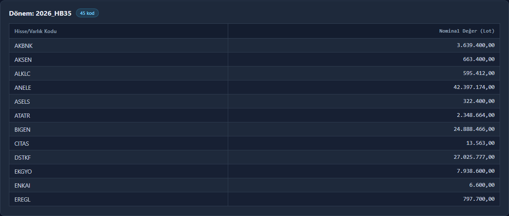

# KAP PDF Downloader & Parser (Sandbox)

TLY had years of positive returns by concentrating in a few names and
absorbing the swings from cash; newer funds in the same style were
already running the same structure. This sandbox opens that portfolio: **what the fund holds, what it buys and sells, and how
concentrated those holdings are** — the structure while it still works,
and the break when the liquid/illiquid mix goes. The
[terminal](../README.md) is the daily series (whale radar, cash buffer).
What those reports showed before September 2026 is in the
[case study](../case_study/CASE_STUDY_2026_09.md).

The frames below are that book, regenerated with the cutoff at
**16.09.2026**. For TLY the latest filing is the weekly report
`2026_HB35`, valued **04.09.2026**. Lot changes, BIST closes, TEFAS AUM
and the purchasing-power matrix all stop on the cutoff: the last
published TEFAS row before the halt. After that TEFAS prints 0 and the names are halted. The
terminal keeps scraping those later rows and marks a zero price as
suspended. This pipeline does not use them.


`download_latest_report` asks KAP for the newest publication and ignores
whatever PDF was already on disk. The file still says Ağustos-2026. The
header matches one TEFAS row, 07.09.2026 (price 9,495.638007, 26,078,554
shares, NAV 247,632,508,542.43 TL). A row dated T is the previous
session's close, so the valuation day is 04.09, and the newest purchase
date in the PDF is 04.09 too. The delta window is the next session
through the cutoff, 05.09–16.09. KAP returned 11 notices. Three were
already inside the PDF and were dropped. Eight named several funds.
None named TLY alone, so nothing was merged as a fact.



Forty-five names, alphabetical. The frame is the top of that list, through EREGL, so DSTKF's 27,025,777 lots can be checked against the estimate. Weights are the next frame. Notices after 04.09 are not in this table.


`Başlangıç Lot` is the PDF. The rows on screen are the largest names, plus TERA so the estimate column is visible. `Kesinleşen Delta` is a notice that names
only this fund; that column is zero in this window. `Oransal Tahmini
Delta` is the purchasing-power split of a manager-level trade. TERA
picks up 933,176 lots that way, and the estimated lot is the PDF plus
that split (12,525,270). The large names did not trade. `Güncel Fiyat`
is the BIST close on 16.09 (DSTKF 2,448.00). The weight divides by the
TEFAS row dated 16.09, **243,624,480,154.28 TL**. That row is the 15.09
valuation, so DSTKF at **27.16%** is the limit-down close on the
previous session's NAV. The same lots at the 15.09 close are 30.2% of
that NAV; the case study uses that cut. Priced names cover 85.23% of
the AUM. The rest has no usable close.

The frames are a short look at that run. The uncut control report — the
full execution log, all 45 names, the evolution table, and the Aktif
Güç matrix — is
[parser_kontrol_raporu_2026-09-16.pdf](parser_kontrol_raporu_2026-09-16.pdf).
It was generated on 05.10.2026 with the cutoff at 16.09.2026.

The folder is decoupled from the terminal. It has its own
`requirements.txt`. It does not import `main.py`. The one bridge is
`data_scraper.py`, used by `load_tefas_records` and
`build_tefas_power_matrix`, and that bridge writes `tefas_cache.json` in
this folder, not the app's `fund_database.json`.

## What a run does

`python kap_delta_engine.py` is the full pipeline. The step numbers match
the log. There is no step 5. "The cutoff" below is 16.09.2026.

| Step | What it uses |
|---|---|
| 0 | `download_latest_report()` asks KAP for the newest publication and deletes other PDFs in that fund's folder, so a July file left on disk cannot stay the baseline. |
| 1 | `apply_delta` layers buy/sell notices from the day after the PDF's measured valuation date through the cutoff. Only a notice that names this fund alone is merged. |
| — | `discover_related_funds` reads the other fund codes on the notices that named several funds. |
| 2 | `collect_global_baseline` downloads each of those funds' own latest PDF. Funds publish on different days; they are not forced onto TLY's period. |
| 3 | `build_tefas_power_matrix` builds a daily "Aktif Güç" through the cutoff. Later rows, and rows with a zero unit price, are dropped. |
| 4 | `resolve_multi_fund_deltas` estimates this fund's share of a manager-level trade. The number is marked as an estimate. |
| 6 | BIST closes and TEFAS AUM are the last prints on or before the cutoff. Weight is estimated lots times that close, over that AUM. |

Step 1 does not guess a per-fund split. KAP publishes one aggregate for
every fund named on the notice. Step 4 is a separate layer: Aktif Güç
that day, this fund's weight in the pool, times the aggregate. If any
named fund has no Aktif Güç that day, or the pool is not positive, that
notice stays out. The evolution table keeps the estimate in its own
column (`Oransal Tahmini Delta Lot`) so it is not presented as a KAP
figure. `Güncel Tahmini Lot` is the sum of the PDF, the exclusive
notices, and that estimate.

Aktif Güç is `AUM × (equity % + liquidity %) / 100`. Liquidity is repo,
reverse repo, money-market lines, and deposits. Repo can be negative, so
this is a net figure. A missing `Varliklar` dict skips that day. A
present dict with no equity key is 0% equity.

## Decisions that stuck

**Buy/sell notices were not missing.** The first delta fetch used the
same `FILTERYFBF` list as the allocation-report downloader. That list
only returns portfolio reports, so TLY came back with zero trades. The
notices are filed by the management company under a different category,
`POST /tr/api/disclosure/members/byCriteria`. A count on 28.07.2026 found
113 of them for TLY's manager over the prior year. A 30-day sample that
week was 23 of 24 multi-fund. The full-year split of that ratio was not
re-counted.

**A file left in the folder became the baseline.** The first global
baseline took whatever PDF was already on disk. A March file from an
earlier session stayed "latest" after KAP had published newer reports,
and every month in between dropped out. `download_latest_report` asks
KAP, orders by `publishDate`, and deletes the other PDFs in that fund's
folder before the parser runs.

**The lot column has no fixed index.** The equity table has no grid
lines, so pdfplumber's line strategy finds nothing. Text-position
extraction then puts the same lot field at index 7 on one page and 8–9
on the next. Each row takes the first Turkish thousands-grouped number.
Section titles are split across cells and are matched on the joined row.
The same ticker on several purchase rows is summed. One check was a
ticker on two rows, `1.255.508,00 + (-524.252,00) = 731.256,00`, matching
the parser to the cent. That figure is from the report used in the
check. It is not the lot in `TLY_2026_HB35.pdf`.

The period-label failure is the next section. It is the one that
double-counted trades rather than crashing.

## The period label is not a date

KAP did not add a field when funds moved from monthly to weekly reports.
The same two fields changed meaning:

| Field | Monthly | Weekly |
|---|---|---|
| `period` | `AB` | `HB` |
| `donem` | month, 1–12 | KAP's own ordinal (`34`, `35`). Not an ISO week and not a date. |

TLY's report published 09.09.2026 is `donem=35`, `period=HB`, attached as
`TLY_2026.08.pdf`, and page 1 still says **Ağustos-2026**. The holdings
are valued **04.09.2026**. ISO week 35 of 2026 ended 30.08, so the
ordinal is a filing number. The display label is `2026 / HB 35`. It does
not say "hafta".

Treating `donem` as a month did two things. On 02.09, `34` crashed
`date(year, donem, 1)`. The patch that forced it back into a month
stopped the crash and named both `HB34` and `HB35` `TLY_2026_08.pdf`, so
one report overwrote the other, and it opened the delta window on 01.09
while the PDF already contained trades through 04.09. On TLY that
double-counted 8 multi-fund notices, with no error. On 14.09 the date
started coming from the PDF's own figures. There is no month-end
fallback.

The filename on disk is now `TLY_2026_HB35.pdf` (`{year}_{code}{ordinal}`).
`download_reports` can keep two weekly files side by side.
`download_latest_report` then deletes the others in that folder, so the
pipeline parses one baseline: the newest publication. `parse_directory`
keys each file by that slug and skips a name with no slug. The slug is
not a date.

## Valuation date

`resolve_as_of_date` matches the PDF's own total value, share count, and
unit price to a TEFAS row. A row dated T is published on T and valued at
the previous recorded business day's close, so the match is shifted back
one recorded day. The newest purchase date in the equities table has to
agree. If the match is missing, ambiguous, or the purchase date disagrees,
it raises `ReportDatingError` and that fund is skipped.

| Report | Label | Measured valuation |
|---|---|---|
| `TLY_2026_HB34` | Ağustos-2026 | 31.08.2026 |
| `TLY_2026_HB35` | Ağustos-2026 | 04.09.2026 |

Deltas start the calendar day after the measured date (`2026-09-05` for
HB35) and stop on the cutoff. The TEFAS window for step 3 is sized to
cover that span. It is not a separate "last 30 days" clock.

## Timeline

| Date | What changed |
|---|---|
| 28.07.2026 | Downloader and parser land in the repo. The buy/sell fetch is pointed at the allocation-report list and returns nothing. The manager-level endpoint replaces it the same day. |
| 30.07.2026 | Related-fund discovery. A fund code resolves from KAP's public list, not only from a handwritten `TLY` entry. |
| 01.08.2026 | Aktif Güç, the proportional estimate, and the execution trace. |
| 03.08.2026 | Per-ticker evolution table, with the day-by-day notices behind each total. |
| 04.08.2026 | The baseline is the newest KAP publication, not a PDF already sitting in the folder. |
| 06.08.2026 | Charts and the dark report. |
| 02.09.2026 | A weekly `donem` no longer crashes. The patch forces it back into a month and double-counts. |
| 14.09.2026 | The valuation date is measured from the PDF. Filenames carry the slug. The percent column is renamed. |
| 30.09.2026 | BIST closes and AUM stop on the cutoff. |
| 05.10.2026 | The delta window and the Aktif Güç matrix use that same cutoff. The frames at the top are this run: HB35 valued 04.09, notices through 16.09. |

## Download and a direct call

KAP's allocation-report list is
`GET /tr/api/disclosure/filter/FILTERYFBF/{company_oid}/{member_oid}/{days_back}`.
`days_back` of 366 or more returns an empty `200`. The default is 365.
The PDF id is not the disclosure id. It is read from
`/tr/Bildirim/{disclosureIndex}`. The download claims
`Content-Type: application/pdf` but the body is a Java `byte[]`. The
module keeps the bytes from the `%PDF` marker onward.

Any fund code resolves through `KNOWN_FUNDS` and then the public fund
list. `member_oid` is one shared constant. On 30.07.2026 this is what
first let DOH, THF, TMV, and FSU download. T3B and TGI had no allocation
report in that window. The reports used in the check included March
filings. That is not the baseline a run selects now.

```bash
pip install -r requirements.txt
python kap_downloader.py          # PDFs only
python kap_delta_engine.py        # full pipeline, writes parser_kontrol_raporu.html
```

```python
from datetime import date
from kap_downloader import KAPPdfDownloader
from kap_pdf_parser import KAPPdfParser
from kap_delta_engine import KAPDeltaEngine, date_baseline_report
from report_dating import load_tefas_records

CUTOFF = date(2026, 9, 16)

with KAPPdfDownloader(fon_kodu="TLY") as downloader:
    latest = downloader.download_latest_report()

pdf = f"tly_pdfs/{latest['file']}"
baseline = KAPPdfParser().parse_file(pdf)
dated = date_baseline_report("TLY", pdf, load_tefas_records(["TLY"])["TLY"])

with KAPDeltaEngine(fon_kodu="TLY") as engine:
    updated, resolved, unresolved = engine.apply_delta(
        baseline,
        start_date=dated.delta_start.isoformat(),
        end_date=CUTOFF.isoformat(),
    )
```

`updated` is the PDF plus notices that named only TLY. `unresolved` is
every multi-fund notice, parsed and not merged. Step 4, inside
`python kap_delta_engine.py`, is what estimates a share of those.

## Report

`export_to_html` writes one dark-theme file: the execution trace, the
exclusive notices, the unresolved multi-fund notices, the proportional
estimates, the evolution table, and the Aktif Güç matrix. Chart.js draws
the top weights and the since-baseline lot changes. The warning above the
table states the window: from the measured valuation date, reset when the
next PDF becomes the baseline. Not a month, and not the period label.

| Column | Meaning |
|---|---|
| Başlangıç Lot | Lots in the latest PDF. |
| Kesinleşen Delta Lot | Notices that named only this fund. |
| Oransal Tahmini Delta Lot | Step 4 estimate. |
| Güncel Tahmini Lot | Sum of those three. |
| Taban Tarihinden Beri Lot Değişimi (%) | Change since that PDF. A new ticker is `YENİ HİSSE`. |
| Güncel Fiyat | BIST close on the cutoff, or the previous session if that name did not print. |
| Güncel Ağırlık (%) | Estimated lots × that close / AUM on the last positive-price row at or before the cutoff. |
